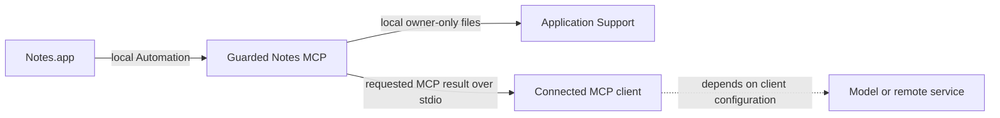

# Privacy

Effective date: August 24, 2026

Guarded Notes MCP is a local stdio server. It does not operate a hosted service,
create an account, collect analytics, or contain code that sends network requests.
It can, however, return private Notes information to the MCP client that launched
it. This document distinguishes those two boundaries.

## Summary

- The server reads Notes.app through local macOS Automation using
  `/usr/bin/osascript`.
- It does not read the Notes database directly and does not require Full Disk
  Access.
- It contains no HTTP client, socket, telemetry, analytics, crash uploader,
  package downloader, or automatic updater.
- It stores review, snapshot, and operation data in the current user's local
  Application Support directory.
- It returns requested metadata and text over stdio to the connected MCP client.
- The connected client may transmit those tool results to a remote model or
  retain them according to that client's settings and terms. Guarded Notes MCP
  does not control that processing.

## Local server versus connected client



“No network code” describes the Guarded Notes MCP server. It does not mean that
the application using the server is offline. When a tool result contains a note
title, snippet, body, account name, folder name, identifier, or operation result,
that information is visible to the connected client and may become part of its
conversation or model input.

Before reading private content, review the client's data controls, model hosting,
retention, workspace policies, and sharing settings.

## Data the server can access

Depending on the selected tool and options, the server can access:

- Notes account names;
- folder identifiers, names, paths, hierarchy, direct note counts, and shared
  status;
- note identifiers, titles, creation and modification timestamps, source folder,
  account, shared status, and locked status;
- plaintext from unlocked notes;
- HTML and plaintext from unlocked notes when a content-inclusive snapshot is
  explicitly requested; and
- current source and destination identifiers needed for a move.

Locked note content is not read. Attachments are not copied or exported.

## Data returned through MCP

Different tools return different subsets:

- inventories and folder tools return account, folder, note, and timestamp
  metadata;
- individual, batch, sequential, and cached-content reads return capped
  plaintext;
- organization manifests return metadata, short snippets, and opaque
  `contentRef` values;
- title-and-content search reads candidate text locally and returns matching note
  metadata; its content phase is capped at 500 candidates, 50,000 characters per
  note, and 10,000,000 characters total;
- plans return exact note titles, identifiers, source folders, and destinations;
- apply results return per-folder/per-note journal states, counts, timing/stop
  information, and a redacted local journal path; and
- safety/status tools return configuration and redacted storage information.

Note-derived fields are labeled untrusted where applicable. Redacting absolute
paths does not make note titles, content, identifiers, or folder names anonymous.

## Local storage

Runtime data is stored beneath:

```text
~/Library/Application Support/Guarded Notes MCP/
```

| Directory or file | Potential contents | Automatic deletion |
|---|---|---|
| `Cache/` | Account name, note metadata, snippets, modification state, and content references. | No |
| `Content/` | Capped plaintext, account name, note identifier, modification timestamp, and length data. | No |
| `Jobs/` | Organization account, progress, timing, cache statistics, identifiers, cursor, and errors. | No |
| `Manifests/` | Account/folder/note metadata, short snippets, protection flags, and content references. | No |
| `Snapshots/` | Metadata by default; optional snapshots can contain readable HTML and plaintext for at most 100 readable notes, capped at 50,000 characters per field. | No |
| `Operations/` | Planned and actual folder/move details, titles, identifiers, deadline, mutation epoch, state transitions, outcomes, errors, and rollback links. | No |
| `move-arm.json` | One plan's token, full digest, exact phrase, creation/expiry time, scope, and random nonce. | Consumed on apply; otherwise remains until disarmed, replaced, or removed. |
| `mutation.lock` | Active apply's operation identifier, process ID, nonce, and creation time. | Removed after safe completion; a verified dead-owner record may be recovered automatically. |
| `mutation.lock.recovery-*` | Temporary lock records used during conservative stale-lock recovery. | Removed when safe recovery completes; conflicting or invalid records remain fail-closed for manual review. |
| `mutation-epoch.json` | Random persisted mutation generation, operation identifier, and update time. | No |

Directories are created with Unix mode `0700`; files are created with `0600`.
These controls apply to ordinary local account access. They are not encryption and
do not protect against software already running as the same user, administrators,
device compromise, backups, or filesystem snapshots. FileVault and normal macOS
account protections are recommended.

Snapshot, plan, and authorization expiry are safety-validity limits, not data
retention limits. A snapshot older than 24 hours remains on disk even though it
cannot authorize a new write. Persistent cache, jobs, manifests, and operation
records remain until removed by the user.

## Incremental content behavior

The organization workflow caches capped plaintext for unlocked notes. On later
runs it compares identifiers, modification timestamps, and folder identifiers and
can reuse unchanged cached content. New or changed bodies use a target group size
that adapts between 25 and 100 notes; the final group may be smaller. Calls
contain no more than 50 notes with concurrency at most two, and each group is
committed before the next one. This bounds full-library retention by the
organization reader, but Notes exposes an individual body as one property, so a
single exceptionally large note may be materialized transiently before it is
sliced to its configured cap.

Removed or changed cache records are updated, but previously written local files
are not presented as a secure-erasure system. Use the cleanup procedure below
when retention is no longer wanted.

`personal_notes_read_cached_content` reads a local content file and does not
contact Notes.app, but the returned plaintext still crosses the MCP boundary to
the client.

## Changes to Apple Notes

Folder creation and same-account note movement are the only Notes writes. The
server does not provide note deletion, folder deletion, or note-content editing.
Operation files preserve the move details needed to review a batch and prepare a
rollback plan. Before an apply writes to Notes, it advances
`mutation-epoch.json`, then creates an `authorized` operation journal. The journal
can reveal which items succeeded, failed, were not attempted, or have an
uncertain outcome after a timeout or interruption.

## Clearing local data

Quit the MCP client first. In Finder, choose **Go > Go to Folder** and open:

```text
~/Library/Application Support/Guarded Notes MCP/
```

Review the contents before moving anything to Trash:

- Removing `Cache/`, `Content/`, `Jobs/`, and `Manifests/` clears organization
  review state and does not alter Notes.
- Removing `Snapshots/` prevents those snapshots from supporting new move or
  rollback plans.
- Removing `Operations/` removes the operation history used to prepare rollbacks.
- Removing `move-arm.json` cancels an unused authorization.
- Do not remove `mutation.lock`, `mutation.lock.recovery-*`, or
  `mutation-epoch.json` as routine cleanup. First quit all connector processes
  and inspect current Notes state and operation journals; these files exist to
  prevent concurrent writes and stale artifact publication. Follow
  [Troubleshooting](docs/TROUBLESHOOTING.md) when one is invalid or stranded.
- Removing the entire Guarded Notes MCP directory clears all server-created local
  state but does not reverse prior moves in Notes.

Keep snapshots and operation records until every recent change has been reviewed.
Moving files to Trash is recoverable until Trash is emptied; backups may retain
copies according to the user's backup settings.

## Repository and support privacy

The public source repository is intended to contain code, synthetic fixtures, and
documentation only. Its `.gitignore` excludes common runtime directory names,
authorization files, archives, logs, environment files, coverage, and dependency
folders. Ignore rules are not a substitute for reviewing every commit.

Never include real note data, runtime files, local paths, authorization values,
or screenshots of a personal library in an issue or pull request. Follow
[Support](SUPPORT.md) for sanitization and [Security](SECURITY.md) for confidential
vulnerability reports.

## Changes to this policy

Material changes to data access, local storage, network behavior, or the MCP
client boundary will be documented in the changelog and released under a new
version. The policy in a tagged release describes that release.
