# Guarded Notes MCP

<p align="center">
  
</p>

[](https://github.com/nextgencods/guarded-notes-mcp/actions/workflows/ci.yml)
[](LICENSE)
[](docs/INSTALLATION.md)
[](package.json)

**Plan first. Move once. Roll back safely.**

Guarded Notes MCP is a local-only [Model Context Protocol](https://modelcontextprotocol.io/)
server and Codex plugin for safely reviewing and organizing Apple Notes on macOS.
It can inventory, search, read, snapshot, plan, and move notes—but it deliberately
cannot delete notes, delete folders, or edit note content.

> [!IMPORTANT]
> The server itself contains no network client, analytics, telemetry, package
> downloads, or update service. Note information returned through MCP is still
> visible to the AI client you connect, so review that client's data controls.

## Why this project exists

General Apple Notes automation tools optimize for breadth. Guarded Notes MCP
optimizes for controlled organization of a valuable personal library. Its write
path requires a recent snapshot, an exact expiring plan, a confirmation phrase,
and a separate one-use authorization created interactively in Terminal. That
authorization is bound to the plan's random token, full 64-character digest,
and exact digest-suffixed confirmation phrase.

Other public Apple Notes MCP servers exist, but the projects reviewed for this
release do not document this complete safety sequence. That is a product-design
difference, not a legal novelty claim. See the [feature comparison](docs/COMPARISON.md)
and [provenance statement](docs/PROVENANCE.md).

| Capability | Guarded Notes MCP |
|---|---|
| Local Apple Notes access through `osascript` | Yes |
| Third-party runtime dependencies | None |
| Direct Notes database access | No |
| Full Disk Access | Not required |
| Incremental organization cache | Yes |
| Restart-safe jobs and manifests | Yes |
| Safety snapshots and exact previews | Required for moves |
| One-use external move authorization | Required |
| Cross-process mutation lock and persisted epoch | Required |
| Operation log and rollback planning | Yes |
| Note or folder deletion | Not implemented |
| Note-content editing | Not implemented |

## Safety flow

```mermaid
flowchart LR
    A[Apple Notes] -->|local osascript| B[Inventory]
    B --> C[Private cache + snapshot]
    C --> D[Reviewable manifest]
    D --> E[Exact expiring plan]
    E --> F[Human review]
    F --> G[Plan-bound Terminal authorization]
    G --> H[Cross-process lock + mutation epoch]
    H --> I[Verified note moves]
    I --> J[Owner-only operation journal]
    J --> K[Rollback plan]
```



After taking the owner-only cross-process mutation lock, the server consumes the
authorization and advances a persisted mutation epoch before the first write.
The authorization cannot approve a second batch. Immediately before each move,
the server also verifies that the note is still in the expected source folder.
Apply batches have a 225-second deadline and keep an atomic owner-only journal;
timed-out mutations are reported as uncertain rather than guessed successful or
failed.

## Install in Codex

Requirements:

- macOS with Apple Notes
- Node.js 22 or newer available as `node`
- Codex or another MCP-compatible local client

Add this GitHub repository as a marketplace source:

```sh
codex plugin marketplace add nextgencods/guarded-notes-mcp --ref v1.0.0
```

Restart the ChatGPT desktop app, open the Plugins Directory, choose the
`nextgencods` source, and install **Guarded Notes MCP**. The repository follows
OpenAI's documented marketplace structure with its plugin under
`plugins/guarded-notes-mcp/`.

For local development or a manual installation, see
[Installation](docs/INSTALLATION.md).

## First use

Start with a read-only request:

> Review my Apple Notes and propose an organization plan without changing anything.

The first call may trigger a macOS Automation prompt allowing the local Node
process to control Notes. Grant Automation access only. Do not grant Full Disk
Access; this project neither requests nor requires it.

For an approved move batch, run the arm command returned by the planning tool.
Paste that same plan's 32-character token and full 64-character digest, then type
its exact generated phrase, including the uppercase 12-character digest suffix.
Do not mix values from different plans.

An unused authorization can be cancelled with:

```sh
node plugins/guarded-notes-mcp/scripts/disarm-moves.mjs
```

## Privacy boundary

Runtime data is stored locally under:

```text
~/Library/Application Support/Guarded Notes MCP/
```

Files are created owner-only (`0600`) and directories owner-only (`0700`). The
source repository contains no note data, account names, machine identifiers,
credentials, or absolute user paths. See [Privacy](PRIVACY.md) for the complete
data-handling statement.

## Documentation

- [Installation and upgrades](docs/INSTALLATION.md)
- [Architecture](docs/ARCHITECTURE.md)
- [Comparison with related projects](docs/COMPARISON.md)
- [Provenance and authorship](docs/PROVENANCE.md)
- [Tool reference](docs/TOOLS.md)
- [Security model](docs/SECURITY-MODEL.md)
- [Privacy](PRIVACY.md)
- [Usage](docs/USAGE.md)
- [Troubleshooting](docs/TROUBLESHOOTING.md)
- [Release process](docs/RELEASING.md)
- [Changelog](CHANGELOG.md)

## Repository layout

```text
.
├── .agents/plugins/marketplace.json   # Git-backed Codex marketplace
├── .github/                           # CI, releases, and community templates
├── docs/                              # Architecture and operating guides
├── plugins/guarded-notes-mcp/         # Distributable plugin
│   ├── .codex-plugin/plugin.json
│   ├── .mcp.json
│   ├── scripts/
│   ├── tests/
│   └── server.mjs
└── scripts/validate-repository.mjs    # Dependency-free release validator
```

## Contributing

Security boundaries are product features here. Changes that add deletion,
content editing, network access, direct database access, or bypass a move gate
will not be accepted without an explicit major-version design decision.

Read [CONTRIBUTING.md](CONTRIBUTING.md) before opening a pull request. For a
vulnerability, follow [SECURITY.md](SECURITY.md) and do not file a public issue.

## Ownership, licence, and trademarks

Created and maintained by [nextgencods](https://github.com/nextgencods).
Released under the [MIT License](LICENSE).

This independent project is not affiliated with, endorsed by, or sponsored by
Apple Inc. or OpenAI. Apple, Apple Notes, macOS, OpenAI, ChatGPT, and Codex are
marks of their respective owners. See [NOTICE](NOTICE).
