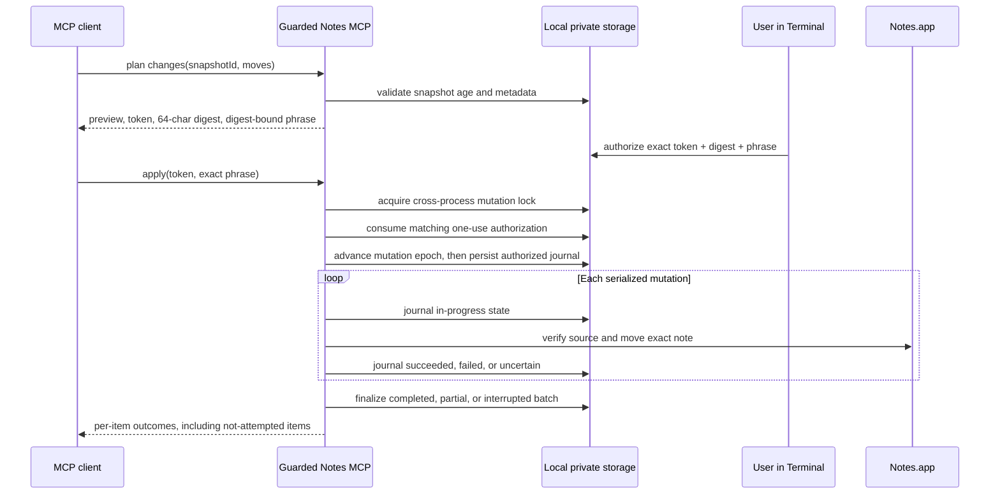

# Architecture

Guarded Notes MCP is a macOS-only, stdio Model Context Protocol (MCP) server. It
runs as a local Node.js process, asks Notes.app for data through macOS automation,
and returns tool results to the MCP client that launched it.

## System boundary

```mermaid
flowchart LR
    U[User] --> C[MCP client]
    C <-->|JSON-RPC over stdio| S[Guarded Notes MCP]
    S -->|argv values| O[/usr/bin/osascript]
    O <--> N[Notes.app]
    S <--> L[Owner-only local storage]

    subgraph Mac[User's Mac]
      C
      S
      O
      N
      L
    end
```

The server imports Node.js built-ins only. It does not open a network listener,
make HTTP requests, download packages, or read the Notes database directly. It
spawns the fixed executable `/usr/bin/osascript` with `shell: false`. Dynamic
account, folder, and note values are passed as process arguments rather than
interpolated into AppleScript or JavaScript for Automation (JXA) source.

The stdio boundary matters: information returned by a tool is delivered to the
connected MCP client. That client may send the result to a remote model according
to its own product settings and privacy terms. See [Privacy](../PRIVACY.md).

## Major components

| Component | Responsibility |
|---|---|
| `.mcp.json` | Starts the bundled server with Node and sets MCP timeouts. |
| `server.mjs` | Implements JSON-RPC framing, tool schemas, validation, automation, caching, planning, writes, and operation records. |
| AppleScript/JXA programs | Read accounts, folders, metadata, and text; create top-level folders; move notes by exact identifier. |
| `scripts/arm-moves.mjs` | Creates an interactive, expiring, one-use authorization outside the MCP channel. |
| `scripts/disarm-moves.mjs` | Removes an unused authorization. |
| `tests/self-test.mjs` | Checks the exposed tool surface and source invariants, exercises fixtures, and compiles automation programs when run on macOS. |

The implementation is intentionally a single server module. There is no runtime
package graph or service tier to deploy.

## Read and organization flows

### Targeted review

1. The client asks for an exact account review.
2. A background in-memory job inventories metadata in bounded pages.
3. A metadata-only snapshot is written after the full inventory completes.
4. The client reads note text in batches while the server advances an in-memory
   review cursor.

Review jobs return immediately when started. Completed or failed in-memory jobs
expire after two hours of inactivity. They do not survive a server restart.

### Incremental organization

1. The server lists folders for one exact account.
2. If an account cache exists, it compares note identifiers, modification times,
   and folder identifiers.
3. Metadata and text are re-read only for new, changed, or moved notes unless a
   full refresh was requested.
4. Changed content is read incrementally with a target group size that adapts
   between 25 and 100 notes; the final group may be smaller. Groups are split
   into automation calls of no more than 50 notes with concurrency at most two.
   Each completed group is committed to the owner-only cache instead of retaining
   full-library bodies in one response.
5. Capped plaintext is stored privately; a shorter snippet and opaque
   `contentRef` are placed in the compact manifest.
6. A metadata-only safety snapshot and a planning manifest are written.
7. Job status, diagnostics, and the manifest cursor are persisted.

If the process restarts during a running organization job, that job is restored
as interrupted and failed. A new job can reuse content already committed to the
incremental cache.

## Change flow



A change plan exists only in server memory and expires after ten minutes. A
snapshot must be less than 24 hours old. The separate authorization also expires
after ten minutes. The arm record contains the exact 32-character plan token,
full 64-character SHA-256 plan digest, and generated confirmation phrase. For a
forward plan, the phrase is `APPLY n MOVES + n FOLDERS [DIGESTPREFIX]`; a rollback
uses `ROLLBACK` in place of `APPLY`. `DIGESTPREFIX` is the uppercase first 12
characters of that digest. All three values must match the same in-memory plan.

Apply first acquires `mutation.lock` with exclusive creation, then renames and
consumes the matching authorization. It advances `mutation-epoch.json`, then
writes the initial `authorized` journal before the first Notes write. The lock
coordinates separate server processes; an in-process queue also serializes
mutation automation. Background review and organization jobs capture the
persisted epoch and repeatedly verify that neither the lock nor epoch changed
before publishing a snapshot or manifest.

Move execution re-checks the note's current source-folder identifier immediately
before moving it. The plan rejects locked notes, shared notes or folders,
cross-account moves, nested source folders, ambiguous destinations, protected
system folder names, duplicate notes, and duplicate folder requests.

Folder creation and note movement are the only Notes writes. A batch has a
225-second wall-clock mutation deadline, with time reserved for cleanup. Before
the first item, the operation moves from `authorized` to `running`. Each item
moves from `not-attempted` to `in-progress`; afterward it records `succeeded`,
`failed`, or `uncertain`. A timeout makes the current outcome `uncertain` and
leaves later work `not-attempted`. Batch state ends as `completed`, `partial`, or
`interrupted`. Journal replacement is atomic and file data is synchronized before
rename; directory synchronization is best-effort on filesystems that reject it.

Rollback planning reverses only moves recorded as successful. It does not infer
the result of an uncertain move and does not delete folders created by the
original operation.

## Local storage

All runtime files are beneath:

```text
~/Library/Application Support/Guarded Notes MCP/
```

| Location | Contents |
|---|---|
| `Cache/` | Account-indexed metadata, snippets, and references to cached text. |
| `Content/` | Capped plaintext for notes read by the organization workflow. |
| `Jobs/` | Persistent organization-job state and timing diagnostics. |
| `Manifests/` | Compact organization manifests containing metadata and snippets. |
| `Snapshots/` | Metadata-only snapshots by default; optional snapshots may include readable note text and HTML. |
| `Operations/` | Folder-creation and move results used for audit and rollback planning. |
| `move-arm.json` | Temporary one-use authorization bound to one plan token, digest, and phrase. |
| `mutation.lock` | Exclusive owner-only record for the active cross-process apply batch. |
| `mutation.lock.recovery-*` | Temporary records used during conservative stale-lock recovery. |
| `mutation-epoch.json` | Persisted generation changed before each authorized write batch. |

Directories are created with mode `0700` and files with mode `0600`. These modes
limit normal Unix access to the current account; they do not defend against code
already running as that account or an administrator.

Snapshots cease to be valid for new writes after 24 hours, but files are not
automatically deleted. Cached content, manifests, jobs, snapshots, and operation
records remain until the user removes them. See [Privacy](../PRIVACY.md) for data
retention and cleanup guidance.

## Bounds and concurrency

| Bound | Implemented value |
|---|---:|
| Maximum library scan | 20,000 notes |
| Public inventory page | 100 notes |
| Internal inventory automation batch | 50 notes |
| Exact-ID text batch | 50 notes |
| Whole text-batch output | 1,000,000 characters |
| Organization content target group | Adaptive 25–100 notes, with a smaller final group; calls of 50, concurrency 2 |
| Complete manifest response | At most 200 notes and approximately 1 MB serialized |
| Content-inclusive snapshot | At most 100 readable notes; 50,000 characters per HTML/plaintext field |
| Title-and-content search | At most 500 candidate notes, 10,000,000 characters total, 50,000 per note |
| Moves per plan | 100 |
| Folder creations per plan | 20 |
| Apply mutation deadline | 225 seconds per batch |
| Folder cache | 5 minutes |
| Completed inventory cache | 2 hours, memory only |
| Snapshot eligibility for writes | 24 hours |
| Plan lifetime | 10 minutes, memory only |
| One-use authorization lifetime | 10 minutes |

Organization status omits the manifest unless `includeManifest: true` is
requested. Even then, an embedded complete manifest is limited to 200 notes and
approximately 1 MB. The manifest reader defaults to persisted-cursor
`mode: next` with a 100-record page; `mode: complete` enforces the same complete
response caps.

Inventory and content reads use bounded concurrency. Large organization jobs
adapt metadata pages and content groups downward when Notes responds slowly, and
commit content incrementally. Mutation automation is serialized both within a
process and across processes.

## Trust assumptions

- The macOS account, Node executable, plugin files, MCP client, and Notes.app are
  trusted to the degree required for local execution.
- Note titles and text are untrusted input. Tool results label them accordingly.
- The client is responsible for approval UI, model selection, remote data policy,
  and retention outside this server.
- A metadata snapshot supports organization rollback; it is not a complete Notes
  backup. Attachments are never copied.
- Notes exposes a body as one property, so a single exceptionally large body may
  be materialized transiently by Automation before the server slices it to its
  documented cap.
- Malformed or conflicting lock/recovery records fail closed. If a recorded PID
  appears live, including after PID reuse, manual inspection may be required
  before any lock file is removed.

For controls, residual risks, and test boundaries, see the
[security model](SECURITY-MODEL.md).
